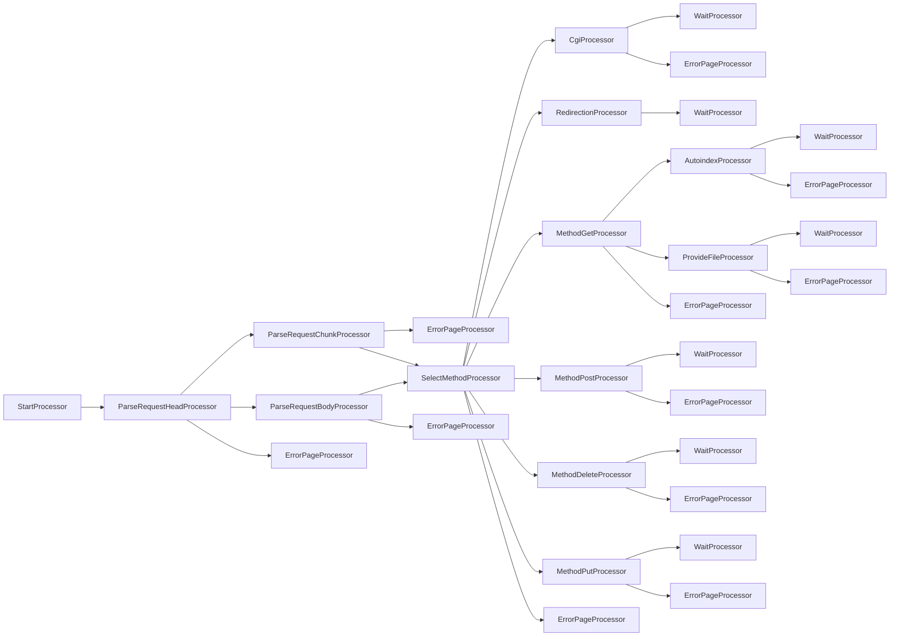

# webserv

webserv convention

- [webserv](#webserv)
  - [Convention](#convention)
    - [header 선언 순서](#header-선언-순서)
    - [class 선언 순서](#class-선언-순서)
    - [naming](#naming)
    - [rules](#rules)

## Convention

### header 선언 순서

```md
c++ header

c header

우리가 만든 헤더
```

### class 선언 순서

public -> protected -> private

```c++
class Name {
public:
  Name();
  Name(int idx);
  Name(const Name &src);
  Name &operator=(const Name &rhs);
  ~Name();

  void anything();

  int idx_;
}
```

### naming

변수, 함수 이름은 무조건 camelCase  
클래스 이름은 PascalCase  
멤버 변수는 `varName_`

accessor는 `getVarName`, `setVarName`  
bool type 함수는 `bool isTrue()` 형식 추천

### rules

```md
- return은 괄호 없이
- space 2칸, 80 column 최대
- 개행은 알아서
- if 한 줄이도 무조건 괄호
- 괄호는 바로 옆에
```

### Processor


